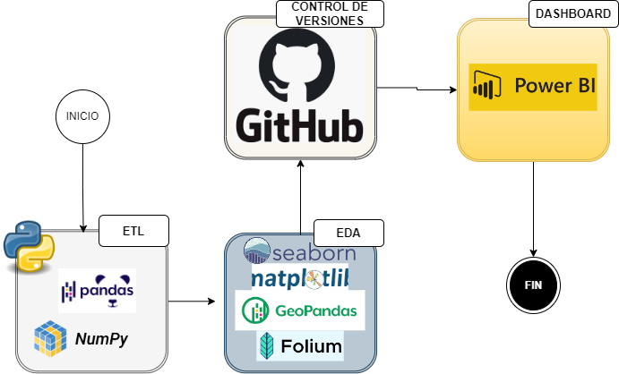
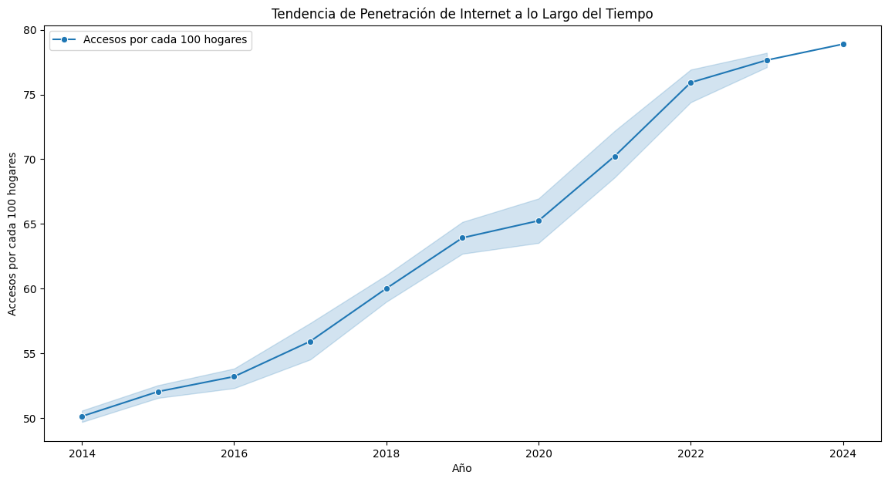
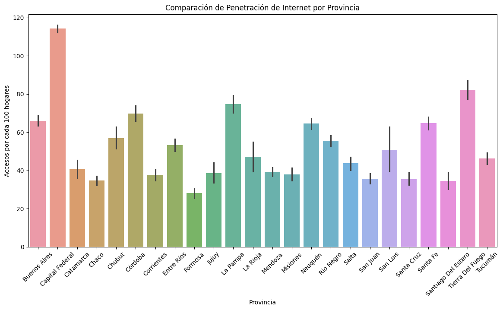
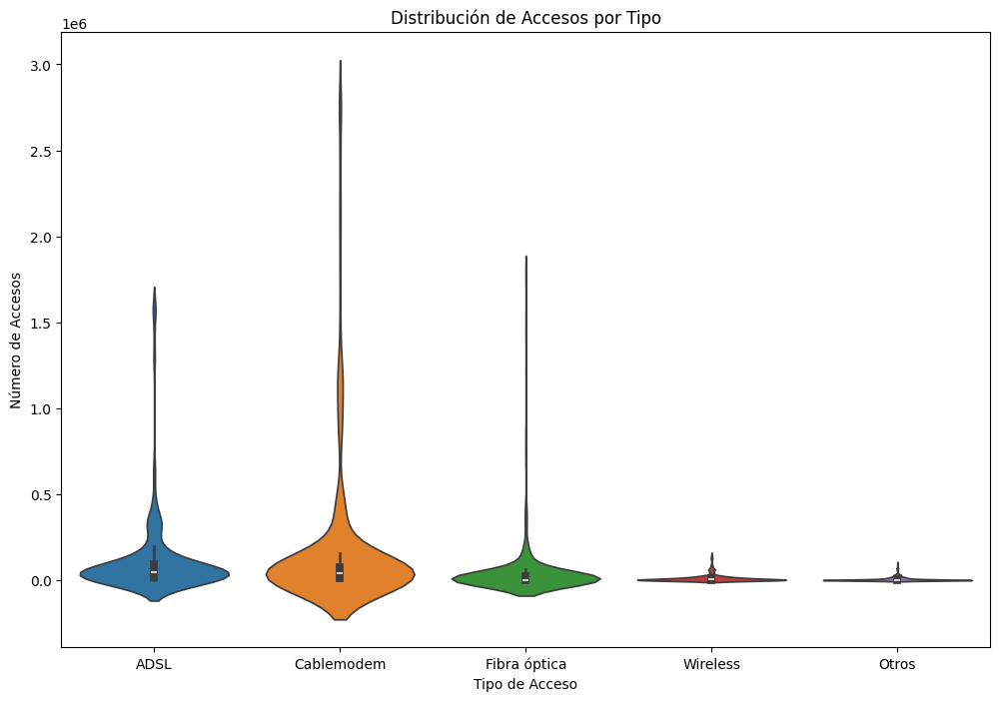
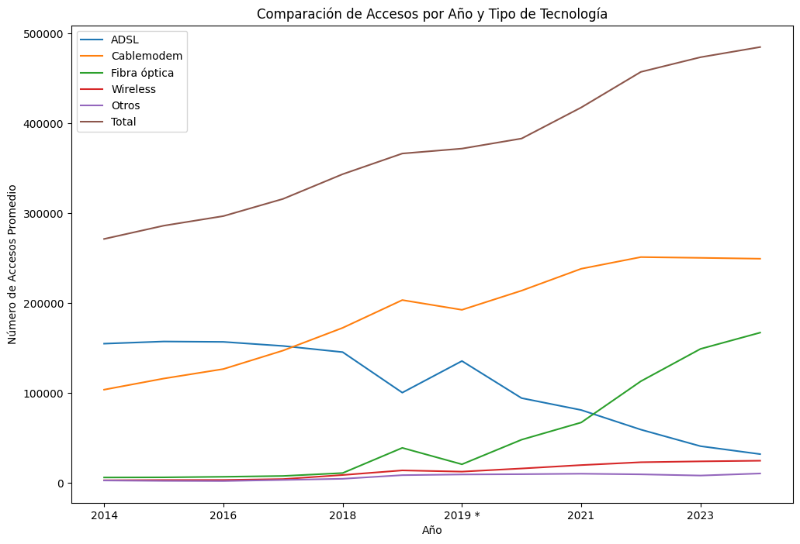
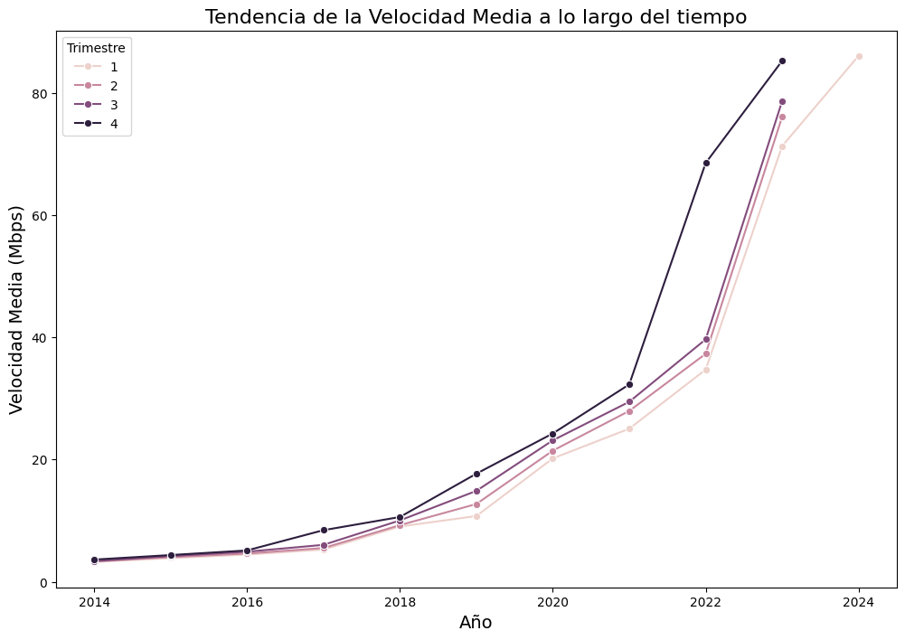
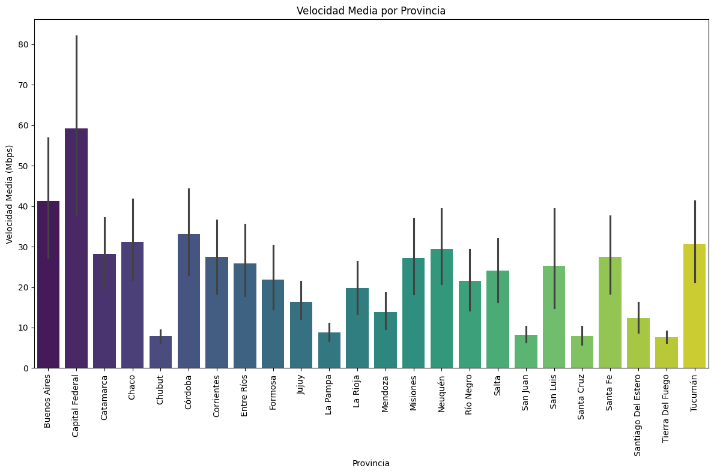
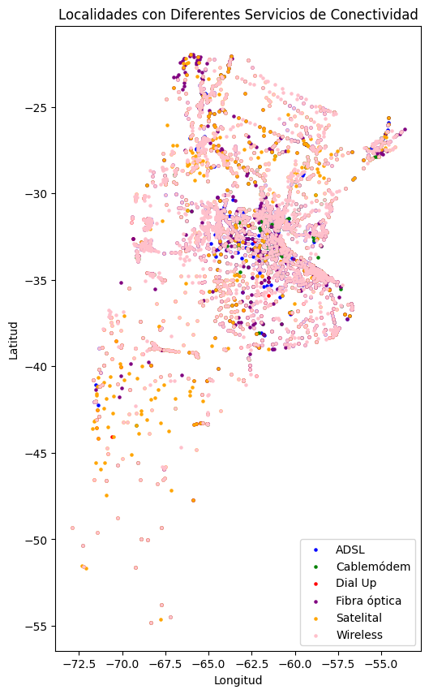

# **Análisis Integral del Sector de Comunicaciones Enfocado en Internet en Argentina: Estrategias de ingreso** 

## Descripción General del proyecto

InvesTech Solutions ha desarrollado un análisis exhaustivo del sector de servicios de comunicación en Argentina, con un enfoque en el acceso a internet, para ayudar a nuestro cliente a mejorar la calidad de sus servicios, identificar oportunidades de crecimiento y desarrollar soluciones personalizadas para su target. Este proyecto abarca la extracción, transformación y análisis de datos, así como la presentación de los resultados en un dashboard interactivo.

## Tecnologías Utilizadas

### ETL (Extracción, Transformación y Carga)

* Pandas: Se usa para la extracción, transformación y carga de datos en formato tabular. Permite leer, escribir o manipular datos en estructuras como DataFrames, realizar operaciones de filtrado, agregación, y mucho más.
* Numpy: Proporciona soporte para arreglos multidimensionales y funciones matemáticas de alto nivel.
  
### EDA (Análisis Exploratorio de Datos)

* Seaborn: Basado en matplotlib, proporciona una interfaz de alto nivel para crear gráficos estadísticos atractivos y fáciles de interpretar.
* Matplotlib: Se utiliza para crear gráficos estáticos, animados e interactivos en Python.
* Geopandas: Extensión de pandas que facilita el análisis de datos geoespaciales.
* folium: Utilizado para crear mapas interactivos que muestren la distribución geográfica de los servicios de comunicación en Argentina.
* warnings: Utilizado para gestionar y suprimir advertencias innecesarias durante el desarrollo

### Dashboard

* Power BI: Herramienta de visualización utilizada para crear un dashboard interactivo que presenta los resultados del análisis de manera clara y comprensible.

### Control de Versiones

* GitHub: Proporciona una plataforma para alojar repositorios de código, colaborar con otros desarrolladores, gestionar versiones del código fuente, realizar seguimiento de los cambios mediante commits y pull requests.

## Estructura del repositorio

* data: Contiene los datasets utilizados para el análisis. 
* image_proyect: Imagenes utilzadas para el despliegue del respositorio.
* etl.ipynb: Notebook utilizado para la extracción, transformación y carga de datos. Aquí se detallan las operaciones realizadas para limpiar y preparar los datos para el análisis.
* eda.ipynb: Notebook de análisis exploratorio de datos (EDA), que incluye gráficos y visualizaciones clave para entender el comportamiento de los datos.
* read.md: Este archivo, que proporciona una visión general del proyecto, explica la estructura del repositorio, detalla el análisis y los KPIs usados en el análisis.

## Enlaces prioritarios para el proyecto

* [Dashboard](https://drive.google.com/drive/folders/1e-_rh0h_IgrZHsa9NbRZUpBNk_Gl9xj0) presentación de concluiones.

## Analisis de los hallazgos

En este apartado se evaluara la penetración y acceso a internet en Argentina identificando patrones, tendencias y disparidades entre las regiones con el objetivo de analizar la viabilidad de ingresar en el mercado. Es importante mencionar que se ha elaborado el siguiente   [Dashboard](https://drive.google.com/drive/folders/1e-_rh0h_IgrZHsa9NbRZUpBNk_Gl9xj0) donde se ssutenta la información que a continuación se expone, y será presentado a nuestro cliente en el horario convenido:

### Penetración de internet por cada 100 hogares (2014-2024)

 Este gráfico ilustra claramente el aumento en la adopción de internet, destacando una tendencia positiva que podría indicar un mercado en expansión.

### Penetración de internet por povincias

Este gráfico resalta las disparidades entre provincias como Formosa y Capital Federal, identificando oportunidades para expandir la cobertura en regiones con baja penetración.

### Tipo de tecnología 

En esta comparación se visualiza la popularidad y variabilidad de cada tecnología, destacando las más adoptadas como la de cable modem.

### Accesos por año y tipo de tecnología

Se entiende de manera clara cómo las preferencias de los consumidores han cambiado hacia tecnologías más avanzadas, como la Fibra Óptica y la fortaleza en cable modem paa el sector.

### Evolución de la velocidad media de conexión

Demuestra el aumento en la demanda de servicios de alta velocidad en el país.

### Velocidad media de internet por provincias

Destaca la variabilidad en las velocidades de conexión entre provincias, resaltando las áreas con mejor y peor infraestructura.

### Distribución de servicios por localización

Las localizaciones urbanas muestran una mayor densidad de servicios, mientras que las áreas rurales presentan una menor disponibilidad, destacando la necesidad de expandir la cobertura.

## key Performance Indicators (KPIs)

En este proyecto, se han definido los siguientes KPI's clave para medir el rendimiento y comportamiento del sector de internet a nivel nacional. Estos indicadores permiten una evaluación detallada y orientada a resultados que ayudará a tomar decisiones estratégicas en función de los datos analizados.

### Aumento en un 2% del Acceso al Servicio de Internet para el Próximo Trimestre por Cada 100 Hogares por Provincia

Este KPI está diseñado para medir el crecimiento en la penetración de internet en los hogares a nivel provincial. El objetivo es alcanzar un aumento del 2% en el acceso a internet para el próximo trimestre en comparación con el trimestre actual, evaluado por cada 100 hogares. Este indicador es esencial para monitorear el impacto de las políticas de expansión de servicios de internet y determinar si se están logrando los objetivos de crecimiento en áreas específicas.

### Tasa de Adopción de Nuevas Tecnologías de Acceso por Provincia

Este KPI mide la tasa de adopción de nuevas tecnologías de acceso a internet, como la fibra óptica, en comparación con las tecnologías existentes. Se enfoca en evaluar cuántos de los accesos actuales están utilizando las tecnologías más avanzadas, proporcionando una visión clara de la transición tecnológica en cada provincia. Este indicador es crucial para entender la evolución tecnológica en las infraestructuras de comunicación y cómo las provincias están adoptando estas nuevas tecnologías.

### Crecimiento en los Ingresos por Servicios de Comunicación por Provincia

Este KPI evalúa el crecimiento en los ingresos generados por los servicios de comunicación de un trimestre a otro. Se calcula comparando los ingresos del trimestre actual con los del trimestre anterior, proporcionando una métrica clara del rendimiento financiero. Este indicador es fundamental para analizar la salud económica del sector de servicios de comunicación en cada provincia y ajustar las estrategias comerciales según el comportamiento del mercado.

## Conclusiones generales

El análisis de los datos muestra un crecimiento sostenido en la penetración de internet y una notable adopción de tecnologías avanzadas en Argentina, lo que indica que el sector de telecomunicaciones está en expansión. Este crecimiento es un claro reflejo de la demanda creciente por servicios de internet de mayor calidad y velocidad en el país. Sin embargo, se identifican disparidades significativas en la penetración de internet y en las velocidades de conexión entre las diferentes provincias.

Estas disparidades representan tanto un desafío como una oportunidad. Las provincias con menor penetración de internet y velocidades de conexión más bajas ofrecen un terreno fértil para inversiones estratégicas. Dirigir recursos hacia estas regiones no solo contribuiría a reducir la brecha digital, sino que también podría generar un retorno de inversión significativo al captar nuevos usuarios que actualmente no tienen acceso a servicios de internet adecuados.

Además, la tasa de adopción de nuevas tecnologías, como la fibra óptica, señala que los consumidores en Argentina están dispuestos a adoptar soluciones de internet más avanzadas, lo que abre la puerta a nuevas ofertas comerciales basadas en tecnologías de última generación. Este apetito por la modernización tecnológica sugiere que las inversiones en infraestructura avanzada no solo son necesarias, sino que también son bienvenidas por el mercado.

En resumen, ingresar en la industria del internet en Argentina parece ser una oportunidad viable y prometedora, especialmente si se focalizan los esfuerzos en las regiones menos servidas. El enfoque en mejorar la cobertura y la calidad del servicio en estas áreas puede no solo ampliar la base de clientes, sino también posicionar a la empresa como líder en la reducción de la desigualdad digital. Además, una estrategia que contemple tanto la expansión de la infraestructura como la promoción de tecnologías emergentes podría maximizar el impacto y garantizar un crecimiento sostenido en el competitivo mercado argentino de telecomunicaciones.

## Contribuciones

Cualquier contribución para mejorar este proyecto es bienvenida. Por favor, realiza un fork del repositorio y envía un pull request con tus cambios.

## Contacto

Para cualquier duda o sugerencia, puedes contactarnos a través de mi perfil de [Github Juan](https://github.com/JPjuanaponte).

**JUAN PABLO APONTE MURCIA**

